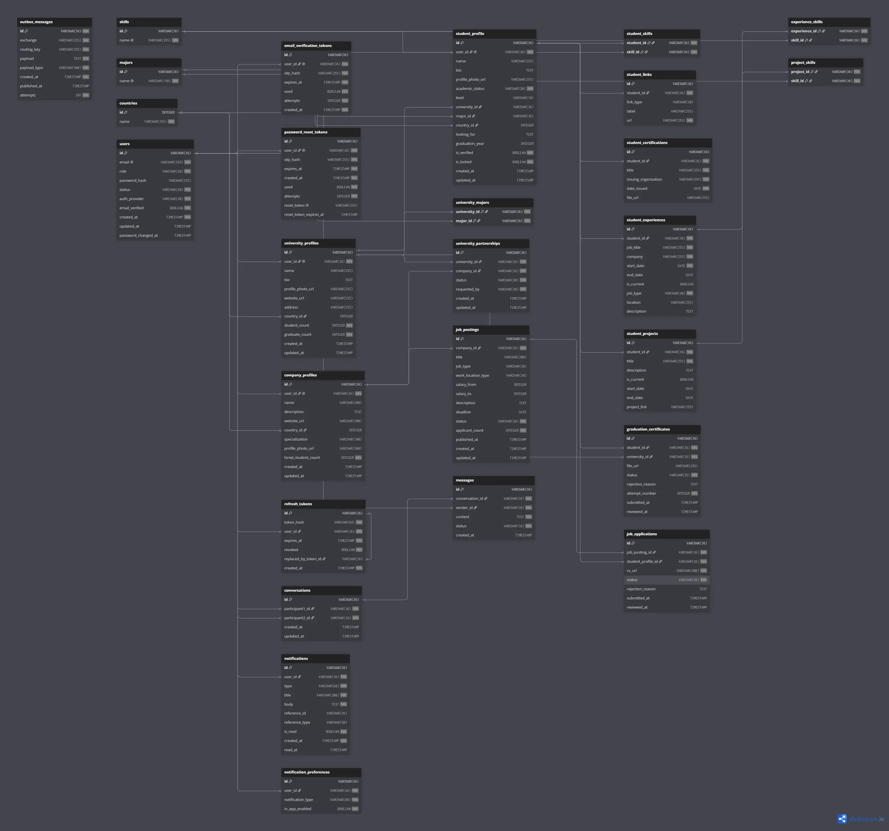
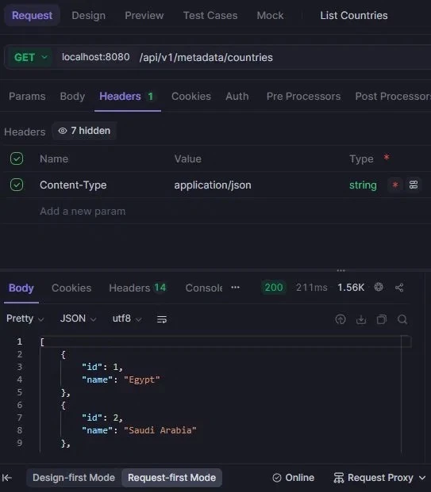
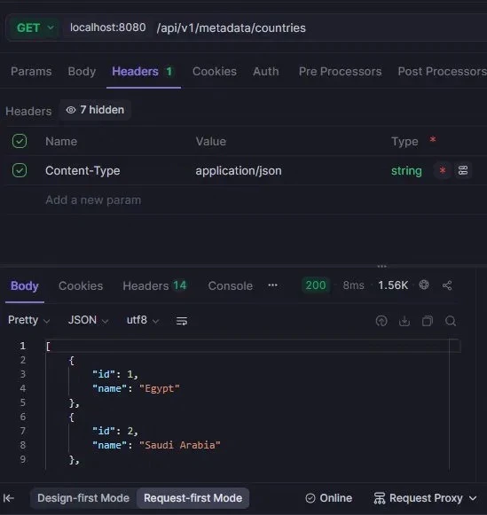
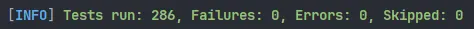

<div align="center">

# UniHub

**An education, recruitment, and communication platform connecting students, universities, and companies.**

[](https://openjdk.org/projects/jdk/17/)
[](https://spring.io/projects/spring-boot)
[](https://angular.dev/)
[](https://www.postgresql.org/)

</div>

---

## What is this?

UniHub is a graduation project I built to deeply understand how large, production-ready platforms are designed and
implemented from scratch. Rather than building a simple CRUD app to check a box, I wanted to experience the real
architectural challenges that come with a multi-actor system module boundaries, event-driven communication, real-time
messaging, secure auth flows, and meaningful test coverage.

The idea was simple: what if students, universities, and companies all had one place to connect? Students build profiles
and apply for jobs. Universities verify credentials and manage partnerships. Companies post jobs, review candidates, and
partner with universities. Everything in one deployable application, built right.

Most of what I learned came from articles, videos, technical books, and conversations with people who've built real
systems. This project is me putting all of that together.

---

## Project Status

| Layer    | Status   | Details                                                                 |
|----------|----------|-------------------------------------------------------------------------|
| Backend  | Complete | All core modules implemented, tested                                    |
| Frontend | Partial  | Auth flows built (registration → email verify → login → password reset) |
| Infra    | Running  | PostgreSQL, Redis, RabbitMQ                                             |

The frontend is intentionally partial. I built enough of it the full auth cycle including OAuth2 to prove I
understand how frontend and backend work together end-to-end. The remaining UI pages (dashboard, student profile, job
board, chat, etc.) follow the same patterns and weren't the focus of this project.

---

## Features

### Backend

**Identity** - the foundation everything else depends on. Covers registration, login, email verification, password reset
via OTP, token refresh, logout with token blacklisting, account deletion, and OAuth2 sign-in via Google and Microsoft.
Login attempts are rate-limited per IP using Redis.

**Student** - a student's complete public presence on the platform. Profile information, work experience, projects,
social/professional links, skills, certifications, and graduation certificate upload. Profile creation is triggered
automatically when a new student registers, via an internal application event.

**University** - university profile management, department majors, student roster, graduation certificate review (
approve/reject), and company partnerships. Universities can see which of their students are employed, track partner
companies, and manage partnership lifecycle.

**Company** - company profile, job posting management (draft and publish separately), applicant tracking (review,
accept, reject), and university partnerships. Companies can also push job opportunities to students from partner
universities.

**Chat** - real-time WebSocket messaging between any two users. Conversations are persisted, and users can load message
history. Message delivery status is tracked.

**Notifications** - in-app notifications delivered over WebSocket. Users set their preferences per notification type.
Notification creation is fully event-driven: listeners respond to events from other modules (new chat message, job
application update, certificate reviewed, partnership accepted/rejected, welcome on registration) and dispatch
accordingly.

**Shared** - the backbone. JWT authentication with a custom filter, token blacklist via Redis, rate limiting, RabbitMQ
configuration and constants, an outbox pattern for reliable async event publishing, file storage abstraction (currently
local, interface ready for S3), global exception handling, country metadata, OTP generation, and cross-module public API
contracts (StudentPublicApi, CompanyJobPublicApi, UniversityPartnershipApi, etc.).

### Frontend - Auth Flows

| Screen                  | Description                                                                  |
|-------------------------|------------------------------------------------------------------------------|
| Register                | Role selection (Student / University / Company), then form submission        |
| Login                   | Email + password                                                             |
| Email Verification      | OTP-based confirmation after registration                                    |
| Forgot Password         | Sends a reset OTP to the user's email                                        |
| Reset Password          | OTP verification followed by new password entry                              |
| OAuth2 Callback         | Handles redirect from Google/Microsoft and exchanges the code for JWT tokens |
| Dashboard (placeholder) | Exists as a landing page after login; no data fetching yet                   |

Core infrastructure is fully wired: an HTTP interceptor that attaches JWT tokens to outgoing requests, an error
interceptor that handles 401/403 globally, route guards for authenticated and guest-only routes, a toast notification
service, and a WebSocket-based notification bell that connects to the backend in real time.

---

## Architecture

UniHub is a **Modular Monolith** built with **Spring Modulith**. One deployable artifact, one database, but with real
enforced boundaries between modules.

Each module follows the same internal structure:

```
module/
├── api/           ← Controllers, request/response DTOs, public-facing interfaces
├── application/   ← Use cases, listeners, mappers
│   ├── usecase/   ← Interfaces (one per operation)
│   └── impl/      ← Implementations
├── domain/        ← Entities, enums, repository interfaces, domain events
└── infrastructure/
    └── persistence/
        ├── impl/  ← Repository implementations
        └── jpa/   ← Spring Data JPA interfaces
```

Modules don't talk to each other directly. A module can only depend on what's explicitly published through a
`@NamedInterface("...")` - the api or events subpackage of another module. Everything else is internal. This is enforced
and verified by a `ModularityTest` that Spring Modulith runs as a regular JUnit test.

Inter-module communication happens through **Spring application events**. When something significant happens in one
module (a user registers, a job application is reviewed, a certificate gets approved), it publishes a domain event.
Other modules subscribe to that event through listeners. The event publisher uses an **outbox pattern** — events are
written to an `outbox_messages` table atomically with the business operation, then relayed by a scheduled job through
RabbitMQ. This means no event is ever silently lost if the application crashes between publishing and delivery.

The diagram below shows how the modules relate:

```
┌─────────────┐     events     ┌─────────────┐     events     ┌──────────────────┐
│  identity   │ ─────────────► │   student   │ ─────────────► │  notifications   │
└─────────────┘                └─────────────┘                └──────────────────┘
       │                              │                                  ▲
       │ events                       │ domain events                    │ events
       ▼                              ▼                                  │
┌─────────────┐               ┌─────────────┐                  ┌─────────────────┐
│  university │ ◄──────────── │   company   │ ────────────────►│      chat       │
└─────────────┘   public api  └─────────────┘   events         └─────────────────┘
       │                             │
       └──────────────┬──────────────┘
                      ▼
               ┌─────────────┐
               │   shared    │  (JWT, Redis, RabbitMQ, Outbox, File Storage)
               └─────────────┘
```

---

## Technology Stack

**Backend**

| Category        | Technology                                        |
|-----------------|---------------------------------------------------|
| Language        | Java 21                                           |
| Framework       | Spring Boot 3.x                                   |
| Module System   | Spring Modulith                                   |
| Security        | Spring Security, JWT, OAuth2 (Google, Microsoft)  |
| Persistence     | Spring Data JPA, PostgreSQL                       |
| Messaging       | RabbitMQ (async events), WebSocket (real-time)    |
| Caching / Store | Redis (token blacklist, login rate limiter)       |
| File Storage    | Local filesystem (FileStorageService abstraction) |
| Validation      | Jakarta Bean Validation                           |
| Build           | Maven                                             |
| Testing         | JUnit 5, Mockito, Spring Modulith test support    |

**Frontend**

| Category  | Technology                      |
|-----------|---------------------------------|
| Framework | Angular 19                      |
| Language  | TypeScript                      |
| Styling   | SCSS                            |
| SSR       | Angular Universal (server.ts)   |
| HTTP      | HttpClient with JWT Interceptor |
| Real-time | WebSocket (notifications)       |

**Infrastructure**

| Service    | Purpose                                            |
|------------|----------------------------------------------------|
| PostgreSQL | Primary database                                   |
| Redis      | Token blacklisting, login rate limiting            |
| RabbitMQ   | Async inter-module event delivery via outbox relay |

---

## Documentation

**Video Walkthrough** — [Watch a Video](docs/Unihub_Test.mp4)
> A Simple video for showing register, login and forget password by frontend

**ERD (Entity Relationship Diagram)** 
> Database schema covering all implemented modules with relationships and key constraints.

**Redis Caching — Response Time**
 
> First call: 211ms (no cache) → Subsequent call: 8ms (Redis cache hit)

**Swagger UI (API Documentation)**
> Interactive API documentation for exploring and testing backend endpoints.

- Local access: http://localhost:{port}/swagger-ui/index.html
- OpenAPI spec: http://localhost:8080/v3/api-docs

**Postman Collection** — [Open in Postman](docs/UniHub_API_Postman.json)

---

## Testing

The backend has **286 passing tests** across 27 test classes, covering every core use case.


> *All 286 tests passing — 0 failures, 0 errors*

Tests are written at the **use case layer** using JUnit 5 and Mockito — no Spring context is loaded, no database is
needed, and each test runs in milliseconds. The focus is on business logic, not plumbing.

| Module       | Test Classes | What's covered                                                                                                                    |
|--------------|--------------|-----------------------------------------------------------------------------------------------------------------------------------|
| `identity`   | 10           | Register, Login, Logout, VerifyEmail, ForgotPassword, ResetPassword, VerifyOtp, ResendVerification, GetCurrentUser, DeleteAccount |
| `student`    | 7            | ProfileCreator, ProfileUseCase, Experience, Projects, Links, Jobs, Certification, Listener lifecycle                              |
| `company`    | 5            | ProfileUseCase, JobPosting, ApplicationUseCase, ApplicationApi, Partnership                                                       |
| `university` | 2            | ProfileUseCase, Partnership                                                                                                       |

---

## Setup

### Prerequisites

- Java 21
- Maven 3.8+
- Node.js 20+ and npm (for frontend)

### 1. Clone the repository

```bash
git clone https://github.com/abanoubwagim/unihub.git
cd unihub
```

### 2. Configure environment variables

Copy the example file and fill in your values:

```bash
cp .env.example .env
```

Then open `.env` and update the following:

```env
# Database
DB_USERNAME=postgres
DB_PASSWORD=your_db_password
 
# JWT
JWT_SECRET=your_jwt_secret_key
JWT_ACCESS_TOKEN_EXPIRY=900000
JWT_REFRESH_TOKEN_EXPIRY=604800000
 
# OAuth2 - Google
GOOGLE_CLIENT_ID=YOUR_GOOGLE_CLIENT_ID
GOOGLE_CLIENT_SECRET=YOUR_GOOGLE_CLIENT_SECRET
 
# OAuth2 - Microsoft
MICROSOFT_CLIENT_ID=YOUR_MICROSOFT_CLIENT_ID
MICROSOFT_CLIENT_SECRET=YOUR_MICROSOFT_CLIENT_SECRET
 
# Mail
MAIL_USERNAME=your_email@gmail.com
MAIL_PASSWORD=your_app_password
```

### 3. Run the backend

```bash
cd unihub-backend
mvn spring-boot:run
```

The API will be available at `http://localhost:8080`.

### 4. Run the frontend

```bash
cd unihub-frontend
npm install
ng serve
```

The frontend will be available at `http://localhost:4200`.

### Run tests

```bash
cd unihub-backend
mvn test
```

---

## Using the app

The easiest way to explore the backend is through the Postman collection linked above - it has all endpoints
pre-configured with example payloads.

For the frontend, the auth flow is the main thing to try:

1. Go to `http://localhost:4200` and click **Register**
2. Choose a role (Student, University, or Company) and fill in the form
3. Check your email for the verification OTP and enter it on the verify screen
4. Log in - you'll be redirected to the dashboard
5. To test OAuth2, click **Continue with Google** or **Continue with Microsoft** on the login screen and follow the
   redirect

Password reset works through Forgot Password → enter email → receive OTP → enter OTP → set new password.

---

## Project Structure

```
unihub/
├── unihub-backend/          # Spring Boot application
│   ├── src/main/java/com/unihub/
│   │   ├── identity/        # Auth, JWT, OAuth2
│   │   ├── student/         # Student profiles and data
│   │   ├── university/      # University profiles and partnerships
│   │   ├── company/         # Company profiles, jobs, applications
│   │   ├── chat/            # Real-time messaging
│   │   ├── notifications/   # In-app notification delivery
│   │   └── shared/          # Cross-cutting infrastructure
│   └── src/test/            # Unit tests per module
├── unihub-frontend/         # Angular application
│   └── src/app/
│       ├── core/            # Guards, interceptors, services, models
│       ├── features/        # Auth screens, dashboard
│       └── shared/          # Reusable components
└── docs/                    # ERD, screenshots, API references
```

---

## What I learned

Building this taught me things that are hard to learn from tutorials alone:

**Module boundaries are hard to maintain without enforcement.** Spring Modulith's `@ApplicationModule` and
`@NamedInterface` don't just document your intent - they enforce it at test time. If I accidentally coupled two modules,
the test breaks. That's how it should work.

**The outbox pattern matters more than it sounds.** Publishing a RabbitMQ event inside a transaction is not the same as
publishing it atomically with the transaction. The outbox pattern solves this properly - write to the outbox table
inside the same transaction as your business operation, then relay asynchronously.

**Frontend and backend integration is where bugs hide.** Building the full auth flow - including OAuth2 redirect
handling, JWT storage, automatic token refresh, and route guards - forced me to understand how the two sides actually
talk to each other in production conditions (not just happy-path GET requests).